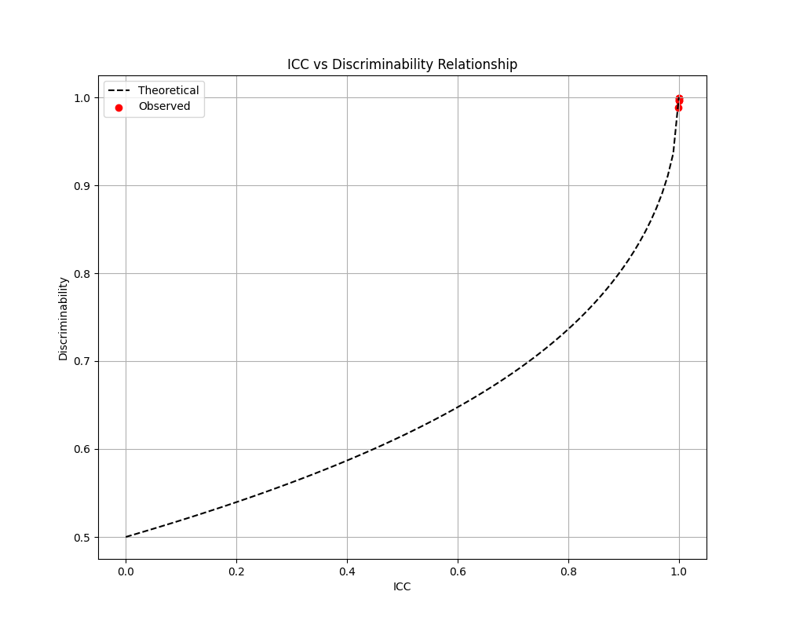
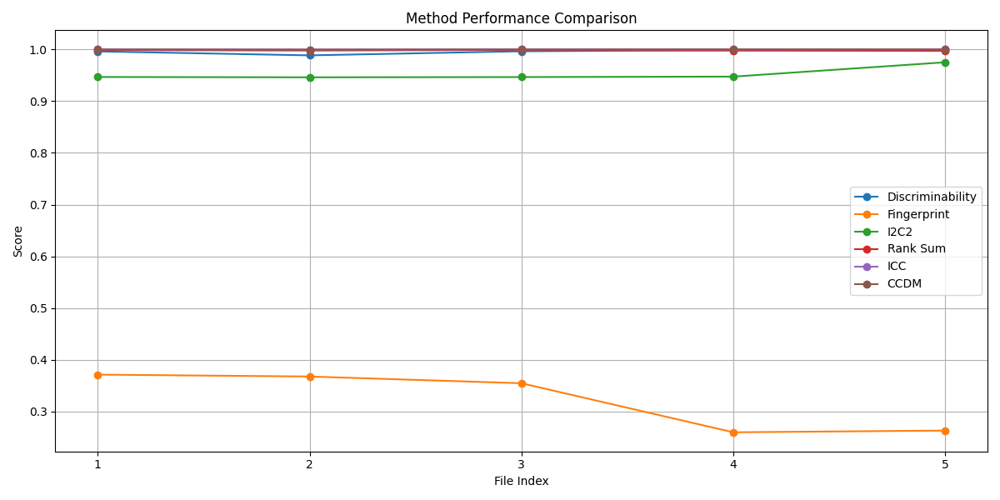
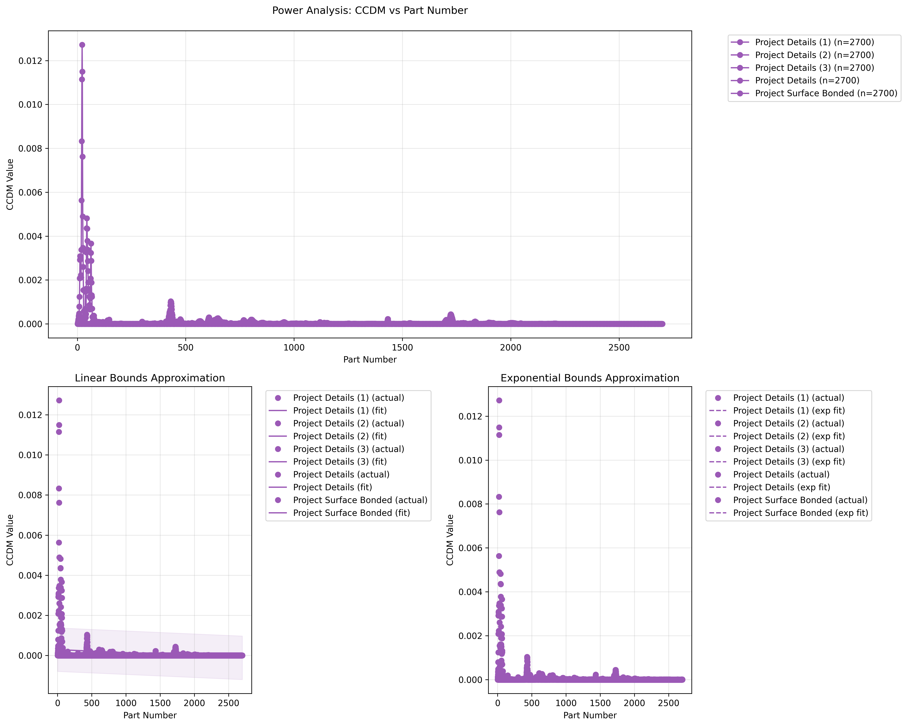

# Comprehensive Measurement System Analysis (MSA)

## Abstract

This repository houses a robust implementation of advanced Measurement System Analysis (MSA) techniques designed to evaluate measurement reliability and repeatability in experimental datasets. Building upon established methodologies in metrology and expanding with novel statistical approaches, this framework provides comprehensive assessment of measurement systems through multiple complementary metrics. The implementation offers particular value for analyzing small-magnitude measurements with potential noise interference, such as those encountered in vibration analysis, material testing, and precision engineering applications.

## Research Background

Reliable measurement processes are fundamental to scientific research and quality control in engineering disciplines. Traditional Gage R&R (Repeatability and Reproducibility) studies often fail to capture the full complexity of modern measurement systems, particularly when dealing with high-dimensional data or when assumptions of classical statistical methods are violated. This implementation draws inspiration from recent advances in statistical repeatability analysis, including the work of Koo & Li (2016) on ICC interpretation guidelines and emerging methodologies for discriminability and fingerprinting metrics.

## Implemented Methodologies

The framework implements seven distinct but complementary measurement system evaluation techniques:

1. **Discriminability (D_hat)** - Probabilistic measure of a measurement system's ability to distinguish between different test specimens, calculated through pairwise comparison of within-subject and between-subject distances.

2. **Fingerprint Index (F_index)** - Evaluates the uniqueness of measurement signatures across test specimens, providing insights into measurement system's identification capabilities.

3. **I2C2 (Image Intraclass Correlation Coefficient)** - Specialized intraclass correlation metric designed for handling two-dimensional measurement data with spatial or temporal correlations.

4. **Rank Sum Statistic** - Non-parametric approach for assessing repeatability using rank-based methods, offering robustness against non-normal distributions.

5. **ICC (Intraclass Correlation Coefficient)** - Classical measure of reliability that quantifies the ratio of between-subject variance to total variance, with interpretative guidelines.

6. **CCDM (Correlation Coefficient Deviation Metric)** - Measures the consistency of correlation patterns across repeated measurements.

7. **Components of Variation** - ANOVA-based decomposition of variance sources (within-part vs. between-part) to identify dominant error contributions.

8. **X-bar Control Charts** - Statistical process control visualization for monitoring measurement stability across repetitions.

## Visualization Capabilities

The implementation generates comprehensive visualizations that aid in interpreting measurement system performance:

<div align="center">
  <table border="0" cellspacing="0" cellpadding="0">
    <tr>
      <td align="center" width="50%">
        
        <p><strong>Theoretical & Observed ICC-Discriminability Relationship</strong><br><em>Demonstrates the mathematical relationship between ICC and discriminability metrics with empirical validation points.</em></p>
      </td>
      <td align="center" width="50%">
        
        <p><strong>Method Performance Comparison</strong><br><em>Visualizes the relative performance of different repeatability measures across datasets.</em></p>
      </td>
    </tr>
    <tr>
      <td align="center" width="50%">
        
        <p><strong>X-bar Control Chart</strong><br><em>Statistical process control visualization showing measurement stability across repetitions.</em></p>
      </td>
      <td align="center" width="50%">
        
        <p><strong>Statistical Power Analysis</strong><br><em>Quantifies each metric's sensitivity under varying sample sizes and variance conditions.</em></p>
      </td>
    </tr>
  </table>
</div>

### Key Visualization Types

* **Relationship Plots** - Visualize theoretical and empirical relationships between different repeatability metrics
* **Control Charts** - Monitor measurement stability and identify potential outliers or trends
* **Power Analysis Curves** - Determine optimal sample sizes for achieving statistical significance
* **Variance Component Breakdowns** - Illustrate the relative contributions of different error sources
* **Method Comparison Graphs** - Compare performance of different statistical approaches across datasets

## Key Features

- **Optimized Memory Management**: Implementation handles large datasets through batch processing and efficient memory allocation strategies.
- **Numerical Stability**: Special handling for extremely small variations that could lead to floating-point precision issues.
- **Comprehensive Reporting**: Detailed variance component analysis with standardized Gage R&R metrics (EV, AV, GRR, PV percentages).
- **Multiple Visualization Options**: X-bar charts, variance component visualizations, power curves, and cross-metric relationship plots.
- **Statistical Power Analysis**: Simulation-based assessment of each metric's sensitivity under different sample sizes and variance conditions.

## Technical Details

The framework employs one-way ANOVA models, Expected Mean Squares (EMS) for variance component estimation, control charting principles, and specialized distance-based metrics. The implementation provides robust handling of:

- Datasets with extremely small variations
- High-dimensional measurement spaces
- Non-Gaussian measurement distributions
- Multiple repetition configurations
- Comparative assessment across different boundary conditions

## Usage

The analysis pipeline accepts Excel-formatted measurement data with the following structure:
- First column: Frequency or sample identifier
- Subsequent columns: Repeated measurements of the same characteristic

```python
# Example usage
analyzer = ComprehensiveMSA()
analyzer.analyze_measurement_system('Project Details.xlsx')
analyzer.visualize_results()
```

## Results Interpretation

The framework provides both numerical assessments and visual aids for interpretation:

- **ICC Values & Interpretation**: < 0.5 (Poor), 0.5-0.75 (Moderate), 0.75-0.9 (Good), > 0.9 (Excellent)
- **Gage R&R Guidelines**: < 10% (Excellent), 10-30% (Acceptable), > 30% (Unacceptable)
- **Number of Distinct Categories (ndc)**: > 5 (Generally acceptable for measurement systems)

## Data Requirements

For optimal results, the measurement data should contain:
- Sufficient number of test specimens (parts/frequencies) to capture part-to-part variation
- Multiple repetitions per specimen to assess repeatability
- Preferably consistent experimental conditions to isolate true measurement system variation

## Project Structure

```
.
├── main.py                                # Main implementation file
├── analysis_results/                      # Generated analysis outputs
├── Project Details*.xlsx                  # Example measurement datasets
├── Project Surface Bonded.xlsx            # Additional measurement dataset
├── analysis_*.png                         # Generated visualizations
├── variance_components_table.csv          # Summary of variance components
└── README.md                              # This documentation
```

## Future Work

- Implementation of multi-way ANOVA models for more complex experimental designs
- Integration of machine learning approaches for outlier detection
- Development of adaptive preprocessing techniques based on measurement characteristics
- Extension to handle multivariate response variables

## References

- Koo, T. K., & Li, M. Y. (2016). A Guideline of Selecting and Reporting Intraclass Correlation Coefficients for Reliability Research. *Journal of Chiropractic Medicine*, 15(2), 155-163.
- AIAG (2010). Measurement Systems Analysis Reference Manual, 4th edition.
- Wheeler, D. J., & Lyday, R. W. (1989). Evaluating the Measurement Process, 2nd edition.
